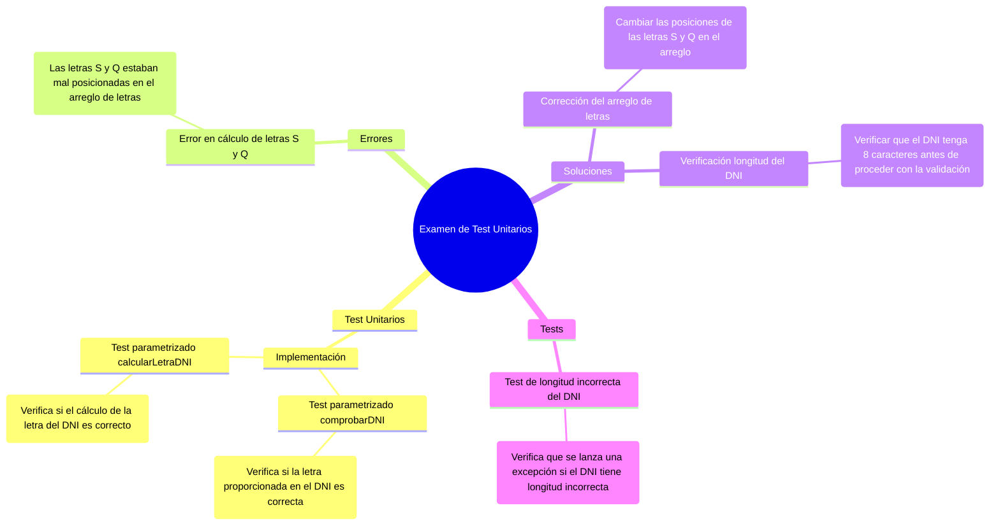
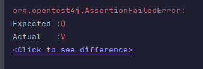

## Examen de Test Unitarios

---

### Enunciado


Con el código de este repositorio realiza:

- (*4 puntos*) Los test unitarios de los **dos** métodos, utiliza test **parametrizados**. Suponiendo que la `string` DNI, siempre es un DNI válido.
- (*2 puntos*) En el código, hay un error, ¿lo pudiste comprabar en los test? ¿Plantea la solución?
- (*3 puntos*) Si no hubiera una comprobación previamente encuanto a la longitud de la `string` del DNI, ¿Qué hay que cambiar en los tests para que comprueben estos casos?

Entrega tu repositorio con el código y los test. Además un `Readme` explicando y justificando cada apartado

Formato del `Readme` *1 punto*

---


### 1. **Los test unitarios de los dos métodos, utiliza test parametrizados. Suponiendo que la string DNI, siempre es un DNI válido.**

He implementado los **test unitarios** utilizando **tests parametrizados** para los dos métodos principales de la clase `Main`: `comprobarDNI` y `calcularLetraDNI`.

- **Test para el método `comprobarDNI`**:
El primer test que creé examina si la letra dada en el DNI es correcta. Para hacer esto, usé **@ParameterizedTest** con **@CsvSource** que me permiten probar variso casos de DNI con su respectivas letras.
```java
@ParameterizedTest
@CsvSource({
    "00000000, T, true",
    "00000001, R, true",
    "00000002, W, true",
    "00000003, A, true",
    "00000004, G, true"
})
void testComprobarDNI(String dni, char letra, boolean validez) {
    assertEquals(validez, Main.comprobarDNI(dni, letra));
}
```
- **Test para el método `calcularLetraDNI`**:
  Este test verifica si el cálculo de la letra del DNI es correcto para varios valores de DNI. También utilicé **@ParameterizedTest** y **@CsvSource** para probar varios DNIs y sus letras.

```java
@ParameterizedTest
@CsvSource({
    "00000000, T",
    "00000001, R",
    "00000002, W",
    "00000003, A",
    "00000004, G"
})
void testCalcularLetra(String dni, char letra) {
    assertEquals(letra, Main.calcularLetraDNI(dni));
}
```

---

### 2. **En el código, hay un error, ¿lo pudiste comprobar en los test? ¿Plantea la solución?**

Sí, en el código original había un error relacionado con el cálculo de las letras **"S"** y **"Q"**. Estos caracteres estaban mal colocados en el array de letras del DNI. Este error se comprobó en los tests.

- **Error**: El arreglo de letras original en el código no tiene la "S" y la "Q" en las posiciones correctas, lo que provoca un cálculo erróneo de la letra en ciertos casos de DNI.

- **Solución**: Para corregir este error, el arreglo de letras debe ser ajustado de la siguiente manera:

```java
char[] letrasDNI = {'T', 'R', 'W', 'A', 'G', 'M', 'Y', 'F', 'P', 'D', 'X', 'B', 'N', 'J', 'Z', 'S', 'Q', 'V', 'H', 'L', 'C', 'K', 'E'};
```


Aquí se muestra el error que se genera por el problema con las letras.
- **Test de corrección**:
  Este test asegura que las letras "S" y "Q" estén correctamente posicionadas:

```java
@Test
void testCalcularLetraEnPosicion() {
    String dni = "00000016"; // Debe devolver 'S'
    assertEquals('S', Main.calcularLetraDNI(dni));

    dni = "00000017"; // Debe devolver 'Q'
    assertEquals('Q', Main.calcularLetraDNI(dni));
}
```

---

### 3. **Si no hubiera una comprobación previamente en cuanto a la longitud de la string del DNI, ¿Qué hay que cambiar en los tests para que comprueben estos casos?**

Si el código original no realiza la comprobación de la longitud del DNI, sería necesario **modificar los tests** para verificar este caso. Específicamente, en los tests debemos asegurarnos de que el DNI tenga exactamente 8 caracteres antes de hacer la validación.

- **Cambio en los tests**:
  Si la longitud del DNI no es correcta, el test debe lanzar una excepción. Aquí hay un ejemplo de cómo podemos modificar los tests para comprobar que el DNI tiene 8 caracteres:

```java
@Test
void testComprobarDNILongitudIncorrecta() {
    String invalidDNI = "12345"; // Longitud incorrecta
    assertThrows(IllegalArgumentException.class, () -> {
        Main.comprobarDNI(invalidDNI, 'T');
    });
}
```

Este test verifica que si el DNI tiene una longitud incorrecta (por ejemplo, 5 caracteres), se genera una **`IllegalArgumentException`**.


